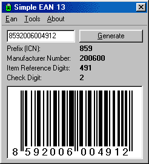



## A \*Simple EAN 13 Generator\*

### Description

A simple aplication that generates the check number and bar code out of 12 numbers set and explains (hopefully) the algorithm for doing so.
 
### More Info
 

             |
---                |---
**Submitted On**   |2002-01-24 10:41:30
**By**             |[David Smejkal](https://github.com/Planet-Source-Code/PSCIndex/blob/master/ByAuthor/david-smejkal.md)
**Level**          |Intermediate
**User Rating**    |4.8 (62 globes from 13 users)
**Compatibility**  |VB 5\.0, VB 6\.0
**Category**       |[Complete Applications](https://github.com/Planet-Source-Code/PSCIndex/blob/master/ByCategory/complete-applications__1-27.md)
**World**          |[Visual Basic](https://github.com/Planet-Source-Code/PSCIndex/blob/master/ByWorld/visual-basic.md)
**Archive File**   |[A\_\_Simple\_506771242002\.zip](https://github.com/Planet-Source-Code/david-smejkal-a-simple-ean-13-generator__1-31131/archive/master.zip)

